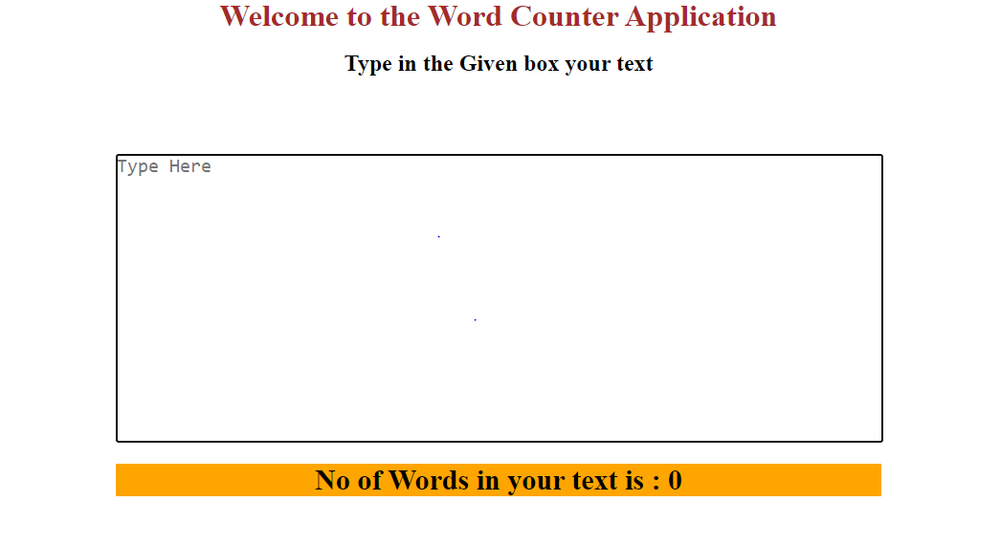
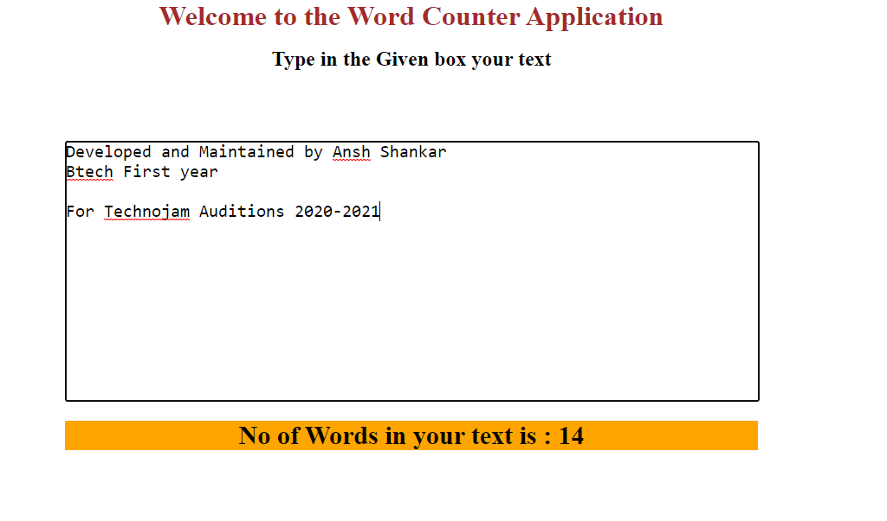

Technojam Auditions Task 10

Build a web application that counts the number of words in a paragraph. (easy)
○ Allows the user to pass a set of lines as input.
○ Displays the count of the words available in input as output.

A simple application using Html, Css, JavaScript

After Giving the Input It works As follows.

