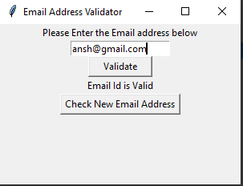

# technojam-task for Auditions
Task-6
Design a desktop application using python to validate an email. (Intermediate)
    Use tkinter for designing UI.
    Use regex for validating user input as a valid email address or not.

In this I made a email address validator using pyhon's Tkinter and re Libraries

After entering email address it tells us the weather the email enter is valid or not.

